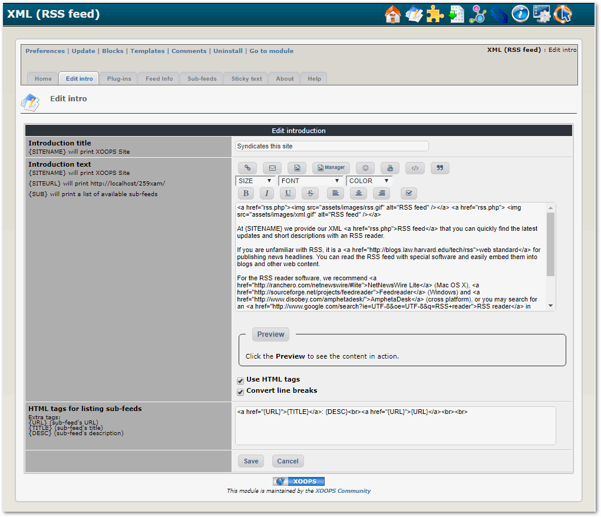
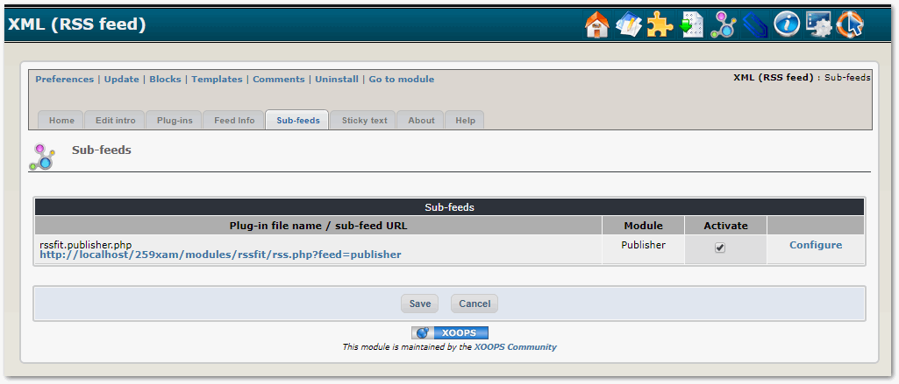

# 2.0 Administration Menu

Here you can edit the intro information that will be visible to the user

The Plugin Tab will show you all available modules, as well as which modules have RSS Plugins that you could install, and which one are already installed.

In the Feed Info Tab you will be able to add required information for your RSS feed

The "Sub-Feeds" tab will show the currently available feeds from your modules.
You can Activate/Deactivate individual modules, and you can also customize their configurations.

Here you can add "Sticky Text" 

In the About tab, you can find out more about the module, incl. the Changelog

The module has a small help for the user...
